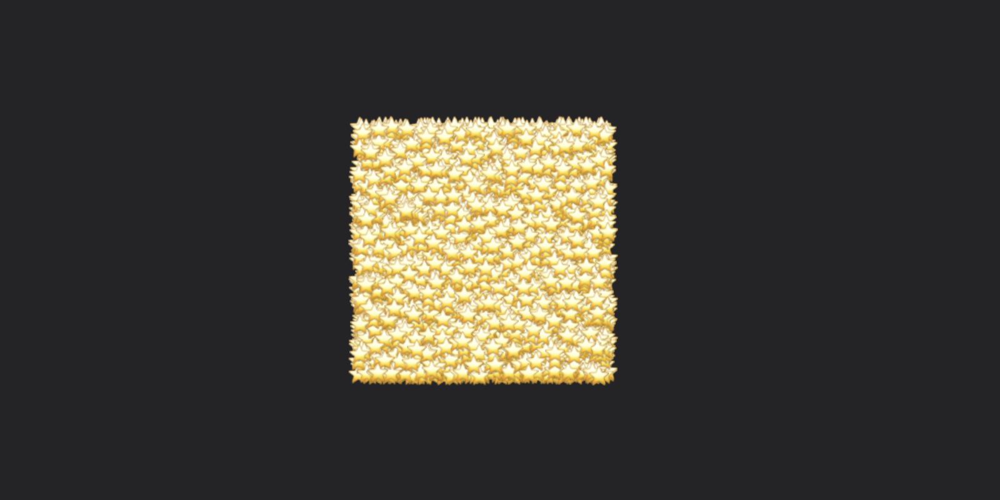

<p align="center">

</p>

> [!IMPORTANT]  
> Particles v2.0 is in **Pre-Release** and it is in active development. If you plan on including Particles in your project, please read this [additional information](#pre-release).

## Native, declarative, and fast.

Create particle systems in a flash using a simple but powerful syntax.

<p align="left">

</p>

```swift
import Particles

var body: some View {
  ParticleSystem {
    Emitter(every: 0.05) {
      Particle {
        Text("✨")
      }
      .initialPosition(.center)
      .initialVelocity(xIn: -1.0 ... 1.0, yIn: -1.0 ... 1.0)
      .hueRotation(angleIn: .degrees(0) ... .degrees(360))
      .glow(.white)
    }
  }
}
```

Easily integrate Particles into your SwiftUI views.

```swift
VStack {
  Text(purchased ? "Thank you!" : "")
    .emits(every: 0.1, if: purchased, offset: CGPoint(x: 0, y: -20)) {
      Particle { Text("❤️") }
        .fixAcceleration(y: 0.05)
        .initialVelocity(xIn: -2.0 ... 2.0, yIn: -2.0 ... -1.5)
        .transition(.scale)
    }
  Button("Purchase") {
    purchased = true
  }
}
```

And jump in with configurable presets.

```swift
import ParticlesPresets

ParticleSystem {
  Preset.Fire()
  Preset.Snow(intensity: 5)
  Preset.Rain()
}
```

## Contents

1. [Quickstart](#quickstart) - install the repository
2. [Entities](#entities) - such as [`Particle`](#particle), [`Emitter`](#emitter), and [`ForEach`](#foreach)
3. [Defining Entities](#defining-entities) - create custom `Entity` structs to use in particle systems
4. [Modifiers](#modifiers) - change the behavior of particles (see [list](#list-of-entity-modifiers))
5. [State Persistence](#state-persistence) - persist `ParticleSystem` simulation through state updates
6. [Presets](#presets) - browse a curated library of preset entities
7. [Pre-Release](#pre-release) - this package is in pre-release, additional information here ⚠️
8. [Performance](#performance) - debugging, frame rate tips, and benchmarks

## Quickstart

To get started, first add Particles as a Swift Package Dependency in your Xcode project:

```
https://github.com/benlmyers/swiftui-particles
```

- To begin with pre-made particles, like Fire or Rain, add and import the `ParticlesPresets` library:

```swift
import ParticlesPresets
```

- Or, to build your own particle systems, add and import the `Particles` library:

```swift
import Particles
```

Create a `ParticleSystem` within your `View`. Then, add some entities or presets!

```swift
struct MyView: View {
  var body: some View {
    ParticleSystem {
      // Add entities here!
    }
  }
}
```

### Supported Versions

- iOS 15.0+
- macOS 12.0+
- watchOS 8.0+

## Entities

Particles has several entities that bring life to your SwiftUI views. Some entities are built using views, and others using other entities.

### Particle

A `Particle` is the building block of the particle system. You can define one using a view:

```swift
Particle {
  Circle().foregroundStyle(.red).frame(width: 10.0, height: 10.0)
}
```

### Emitter

An `Emitter` fires new entities on a regular interval.
<p align="left">

</p>

```swift
Emitter(every: 0.02) { // Fires every 0.02 seconds
  Particle {
    Text("😀")
  }
  .initialAcceleration(xIn: -1.0 ... 1.0, yIn: -1.0 ... 1.0)
  .initialTorque(.degrees(1.0))
}
```

### Group

A `Group` holds multiple entities. Like SwiftUI, modifiers applied to a Group will be applied to all entities inside the Group.

<p align="left">

</p>

```swift
ParticleSystem {
  Group {
    Particle { Text("🔥") }
    Particle { Text("🧨") }
  }
  .glow(.red) // Both particles will have a red glow
}
```

While the name clashes with SwiftUI's, in most cases you needn't worry. The `ParticleSystem` initializer tells the compiler to expect an `Entity`-conforming rather than a `View`-conforming `Group`.

### ForEach

Like `Group`, `ForEach` holds multiple entities iterated over a collection of elements.

```swift
ParticleSystem {
  ForEach([1, 2, 3, 4]) { i in
    Particle { Text("\(i)") }
      .initialVelocity(xIn: -1.0 ... 1.0) // Modifiers can also be applied outside of ForEach
  }
}
```

Above, four view is registered; one for each particle. You can improve the performance of `ForEach` by merging views, or in rarer cases, entity declarations:

#### Merging Views

<p align="left">

</p>

```swift
ForEach(myLargeCollection, merges: .views) { item in
  Particle {
    Text("⭐️")
  }
  .initialPosition(xIn: 0 ... 100, yIn: 0 ... 100)
}
```

Here, only the first view is registered, and the rest of the entities receive the same view. To learn more about `merges: .views`, see [Performance](#performance).

### Lattice

A `Lattice` creates a grid of particles that covers and samples the colors of a `View`. You can customize the behavior of each particle in the `Lattice` by applying modifiers.

<p align="left">

</p>

```swift
ParticleSystem {
  Lattice {
    Image(systemName: "star.fill")
      .resizable()
      .frame(width: 100.0, height: 100.0)
      .foregroundStyle(Color.red)
  }
  .scale(1.5)
  .initialVelocity(xIn: -1.0 ... 1.0, yIn: -1.0 ... 1.0)
}
```

> [!CAUTION]  
> A known issue with Lattice is present on iOS. We are investigating a fix in issue #5.

> [!WARNING]  
> Particles is in **Pre-Release**. While the API for `Lattice` is to remain unchanged, there is a known performance issue with this entity. `Lattice` uses an expensive initializer that can cause a delay in appearance. This will be optimized before release.

## Defining Entities

You can define a custom entity by conforming a `struct` to `Entity` and providing a value for `var body: some Entity`.

```swift
struct MyEmojiParticle: Entity {
  var emoji: String
  var body: some Entity {
    Particle {
      Text(emoji)
    }
  }
}

struct MyView: View {
  var body: some View {
    ParticleSystem {
      MyEmojiParticle(emoji: "😀")
    }
  }
}
```

## Modifiers

Particles has several modifiers you can apply to entities to change their behavior.

```swift
ParticleSystem {
  Particle {
    Image(systemName: "leaf.fill")
  }
  .lifetime(3) // particle lasts 3 seconds
  .colorOverlay(.orange) // particle is orange
  .blur(in: 0.0 ... 3.0) // particle has random blur effect
}
```

Some modifiers, like `.initialPosition(x:y:)`, affect the initial behavior of an entity; while others, like `.fixPosition(with:)` affect the behavior on each frame.

Like SwiftUI modifiers, *most*\* entity modifiers are applied *outside first*, *inside last*. For instance, since `.initialPosition(...)` *sets* a particle's position, applying this modifier **above** `.initialOffset(...)` will cause the offset to not be applied. `.initialOffset(...)`, which *changes* the position, must be written *inside*.

\* *Some rendering operations, like `.colorOverlay(...)` or `.hueRotation(...)`, follow a static ordering despite modifier ordering.*

### List of Entity Modifiers

- Lifetime
  - `.lifetime(...)`
- Position and Offset
  - `.initialPosition(...)`
  - `.initialOffset(...)`
  - `.fixPosition(...)`
- Velocity and Acceleration
  - `.initialVelocity(...)`
  - `.fixVelocity(...)`
  - `.initialAcceleration(...)`
  - `.fixAcceleration(...)`
- Rotation and Torque
  - `.initialRotation(...)`
  - `.fixRotation(...)`
  - `.initialTorque(...)`
  - `.fixTorque(...)`
  - `.rotation3D(x:y:z:)`
- Effects
  - `.opacity(...)`
  - `.blendMode(_:)`
  - `.colorOverlay(...)`
  - `.hueRotation(...)`
  - `.blur(...)`
  - `.scale(...)`
  - `.glow(...)`
  - `.shader(...)`
- Transitions
  - `.transition(_:on:duration:)`
- Custom Behavior
  - `.onAppear(perform:)`
  - `.onUpdate(perform:)`
  
### Other Modifiers

- `ParticleSystem.debug()` - enables *[Debug Mode](#debug-mode)* for the particle system, showing performance metrics
- `ParticleSystem.statePersistent(_:refreshesViews:)` - enables *[State Persistence](#state-persistence)* for the particle system
- `Emitter.emitSingle(choosing:)` - instructs `Emitter` to emit one particle at a time
- `Emitter.emitAll()` - instructs `Emitter` to emit all passed particles at once
- `Emitter.maxSpawn(count:)` - stops emitting entities after `count` are emitted
- `Lattice.customView(view:)` - customizes the view of `Lattice` particles

When importing `Particles`, you also have access to some useful view modifiers.

- `View.particleSystem(atop:offset:entities:)` - creates a particle system centered at the modified view
- `View.emits(every:if:atop:simultaneously:entities:)` - emits specific entities on an interval from the center of the modified view
- `View.dissolve(if:)` - dissolves the view (using `Lattice`) if `condition` is true
- `View.burst(if:)` - bursts the view if `condition` is true

All modifiers are documented with parameter information.

> [!WARNING]
> Particles is in **Pre-Release**. The API for the four view modifiers listed above may be changed before release.
  
## State Persistence

`ParticleSystem` has the ability to persist its simulation through `View` state refreshes. To enable this functionality, provide a string tag to the `ParticleSystem`:

```swift
struct MyView: View {
  @State var foo: Bool = false
  var body: some View {
    VStack {
      Button("Foo") { foo.toggle() }
      ParticleSystem {
        Emitter {
          if foo {
            Particle(view: { Text("😀") }).initialVelocity(withMagnitude: 1.0)
          } else {
            Particle(view: { Image(systemName: "star") }).initialVelocity(withMagnitude: 1.0)
          }
        }
      }
      .statePersistent("myEmitter")
    }
  }
}

```

State refreshing works on all levels of the particle system, even in views inside `Particle { ... }`. You can also use `if`/`else` within `ParticleSystem`, `Emitter`, `Group`, and any other entity built with `EntityBuilder`. 

## Presets

A curated list of presets are available. These can be configured using parameters. Several additional presets will be added before the packages reaches a Release state.

- [`Fire`](Sources/ParticlesPresets/API/Presets/Fire.swift)
- [`Snow`](Sources/ParticlesPresets/API/Presets/Snow.swift)
- [`Magic`](Sources/ParticlesPresets/API/Presets/Magic.swift)
- [`Rain`](Sources/ParticlesPresets/API/Presets/Rain.swift)
- [`Smoke`](Sources/ParticlesPresets/API/Presets/Smoke.swift)
- [`Stars`](Sources/ParticlesPresets/API/Presets/Stars.swift)

ParticlesPresets is accepting preset submissions in the form of pull requests. [Contributing guidelines](CONTRIBUTING.md)

> [!WARNING]  
> ParticlesPresets is in **Pre-Release**. The appearance of currently available presets are subject to change, as are their parameters. Avoid including presets in production code. [More information](#pre-release)

### Example Project

This package contains an example project where you can preview and tweak the library of available presets. To run it, open the example's [Xcode project file](Examples/ParticlesExample/ParticlesExample.xcodeproj) located in **Examples/ParticlesExample**.

## Pre-Release

This package is in a pre-release state, which means certain parts of it are subject to change. The following is a roadmap to Release (and conseqeuently, a list of planned API changes):

- Streamlined demos for presets
- Several new preset entries
- View modifier improvements, like `.burst(if:)` or `.emits(...)`

## Performance

Particles can support the use of thousands of entities when compiled in **Release** scheme. As more modifiers and entities are added, `ParticleSystem`'s frame rate will lower.

### Debug Mode

Use `ParticleSystem.debug()` to enable Debug Mode.


You can debug a `ParticleSystem` to view performance statistics, including *view size*, *frame rate*, *proxy count*, *entity count*, *registered view count*, *proxy update time*, and *rendering time*.

`ParticleSystem` targets 60 FPS, meaning each frame must update in `1.0 / 60.0 = 0.01666..` seconds, or 16.66ms. Each frame update is roughly equal to the max of *proxy update time* and *rendering time*. If this exceeds 16ms, frames will begin to drop.

### Improve Frame Rate

- Particles runs faster in **Release** compile scheme as compared to **Debug**.
- If you are using many entity modifiers, consider combining behavior into a single closure using `.onAppear(...)` or `.onUpdate(...)`.
- Modifiers with custom closures containing expensive operations will increase proxy update time.
- An increased amount of effect modifiers, like `.glow(...)` or `.blur(...)`, will increase rendering time. 
- Use `ForEach(merges: .views)` if the view passed to `Particle` is the same across ForEach's data mapping.
- Use `ForEach(merges: .entities)` if mapped entities only variate in their initial properties. `merges: .entities` tells `ForEach` (aka `Group`) to endow each created `Proxy` with properties determined by the mapped `Entity` **only upon birth**. After the proxy is born with its initial properties, like position, rotation, or hue rotation, it's entity rules are merged to the **first data mapping's** upon update.

### Benchmarks

Performance Benchmarks will be available when this packages reaches a Release state.
